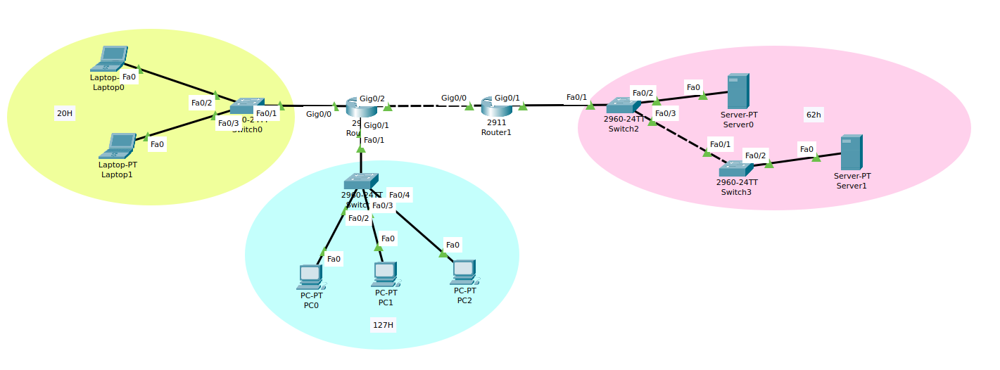

# Lab 01 - RECAP CCNA1


## Topologie



## Cerinte

1. Setati hostname-urile conform listei: 20p
    - R0 - Bucuresti
    - R1 - Constanta
    - Sw0 - Brasov
    - Sw1 - Pitesti
    - Sw2 - Costinesti

2. Subnetați spațiul **10.10.20.0/22** conform cerințelor topologiei.
   Adresa default gateway-ului (prima adresa asignabila) este inclusă deja în numărul de host-uri dat:
    a. Asignati adresele corespunzatoare fiecarui end devce, in ordinea index-urilor. 20p
    b. Asignati adresele ip corespunzatoare fiecarui port de router. 30p

3. Configurati rutele statice necesare pentru comunicare end-to-end. 30p


## Task 1


Router0:
```sh
Router> en
Router# conf t
Router(config)# hostname Bucuresti
Bucuresti(config)# 
```

Router1:
```sh
Router> en
Router# conf t
Router(config)# hostname Constanta
Constanta(config)# 
```

Switch0:
```sh
Switch> en
Switch# conf t
Switch(config)# hostname Brasov
Brasov(config)# 
```


Switch1:
```sh
Switch> en
Switch# conf t
Switch(config)# hostname Pitesti
Pitesti(config)# 
```


Switch2:
```sh
Switch> en
Switch# conf t
Switch(config)# hostname Costinesti
Costinesti(config)# 
```


## Task 2


**10.10.20.0/22** -> subnetare optima (**VLSM**)


Retele (ordonate DESC dupa numarul de hosts):
1. albastru; 127H
2. roz: 62H
3. galben: 20H
4. Router0-Router1: 2H


Noile masti (prefix):
1. 127H + 2H (IP retea + IP broadcast) = 129H <= 256 = 2^8 -> /(32-8) = /24
2. 62H + 2H = 64H <= 2^6 -> /(32-6) = /26
3. 20H + 2H = 22H <= 32 = 2^5  -> /(32-5) = /27
4. 2H + 2H = 4H = 2^2 -> /(32-2) = /30

Noile masti (decimal):
1. /24 -> 255.255.255.0
2. /26 -> 255.255.255.192
3. /27 -> 225.255.255.224
4. /30 -> 255.255.255.252

Intervale (IP retea -> IP broadcast):
1. 10.10.20.0/24 -> +2^8-1 -> 10.10.20.255/24
2. 10.10.21.0/26 -> +2^6-1 -> 10.10.21.63/26
3. 10.10.21.64/27 -> +2^5-1 -> 10.10.21.95/27
4. 10.10.21.96/30 -> +2^2-1 -> 10.10.21.99/30


## Asignare adrese IP: reteaua albastru (127H)

- Router0:
```sh
Bucuresti(config)# int gig0/1
Bucuresti(config-if)# ip address 10.10.20.1 255.255.255.0
Bucuresti(config-if)# no shut
```

- PC0 (Desktop -> IP Configuration):
  - IPv4 Address: 10.10.20.2
  - Subnet Mask: 255.255.255.0
  - Default Gateway: 10.10.20.1

- PC1 (Desktop -> IP Configuration):
  - IPv4 Address: 10.10.20.3
  - Subnet Mask: 255.255.255.0
  - Default Gateway: 10.10.20.1

- PC2 (Desktop -> IP Configuration):
  - IPv4 Address: 10.10.20.4
  - Subnet Mask: 255.255.255.0
  - Default Gateway: 10.10.20.1


## Asignare adrese IP: reteaua roz (62H)

- Router1:
```sh
Constanta(config)# int gig0/1
Constanta(config-if)# ip address 10.10.21.1 255.255.255.192
Constanta(config-if)# no shut
```

- Server0:
  - IPv4 Address: 10.10.21.2
  - Subnet Mask: 255.255.255.192
  - Default Gateway: 10.10.20.1

- Server1:
  - IPv4 Address: 10.10.21.3
  - Subnet Mask: 255.255.255.192
  - Default Gateway: 10.10.20.1


## Asignare adrese IP: reteaua galben (20H)

- Router0:
```sh
Bucuresti(config)# int gig0/0
Bucuresti(config-if)# ip address 10.10.21.65 255.255.255.224
Bucuresti(config-if)# no shut
```

- Laptop0:
  - IPv4 Address: 10.10.21.66
  - Subnet Mask: 255.255.255.224
  - Default Gateway: 10.10.21.65

- Laptop1:
  - IPv4 Address: 10.10.21.67
  - Subnet Mask: 255.255.255.224
  - Default Gateway: 10.10.21.65

## Asignare adrese IP: reteaua Router0-Router1 (2H)

- Router0:
```sh
Bucuresti(config)# int gig0/2
Bucuresti(config-if)# ip address 10.10.21.97 255.255.255.252
Bucuresti(config-if)# no shut
```

- Router1:
```sh
Constanta(config)# int gig0/0
Constanta(config-if)# ip address 10.10.21.98 255.255.255.252
Constanta(config-if)# no shut
```


## Task 3

> Solutia nu se afla in **rutele default**.
> Trebuie adaugata cate o ruta pentru fiecare retea.

- Router0:
```sh
! Go to pink via Router1-gig0/0
Bucuresti(config)# ip route 10.10.21.0 255.255.255.192 10.10.21.98
```

- Router1:
```sh
! Go to blue via Router0-gig0/2
Constanta(config)# ip route 10.10.20.0 255.255.255.0 10.10.21.97

! Go to yellow via Router0-gig0/2
Constanta(config)# ip route 10.10.21.64 255.255.255.224 10.10.21.97
```

