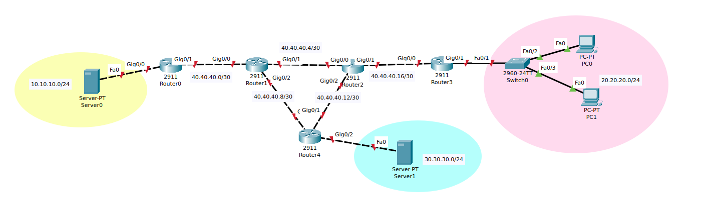

# Lab 02: Laborator Rutare Statica


## Topologie



## Cerinte

1. Asignati IP-urile conform topologiei.
    Prima adresa asignabila va fi a default gateway-ului si urmatoarele a end device-urilor in ordinea indicilor.
    In cazul retelelor dintre routere se va asigna prima adresa routerului din stanga. 50p

2. Configurati rute statice astfel incat sa existe conectivitate end-to-end. Vizualizati tabela de rutare a routerelor.
   - > HINT: Aveti grija la bucle de rutare. 30p

3. Configurati o ruta default pe Router0.
    Pentru acest punct, va trebui sa stergeti toate rutele de pe R0. 10p

4. Creati o ruta flotanta pe R1 spre reteaua roz avand Distanta Administrativa 3. 10p


## Task 1


- Router0:
```sh
Router0(config)# int gig0/0
Router0(config-if)# ip address 10.10.10.1 255.255.255.0
Router0(config-if)# no shut
Router0(config-if)# exit
Router0(config)# int gig0/1
Router0(config-if)# ip address 40.40.40.1 255.255.255.252
Router0(config-if)# no shut
```

- Router1:
```sh
Router1(config)# int gig0/0
Router1(config-if)# ip address 40.40.40.2 255.255.255.252
Router1(config-if)# no shut
Router1(config-if)# exit
Router1(config)# int gig0/1
Router1(config-if)# ip address 40.40.40.5 255.255.255.252
Router1(config-if)# no shut
Router1(config-if)# exit
Router1(config)# int gig0/2
Router1(config-if)# ip address 40.40.40.9 255.255.255.252
Router1(config-if)# no shut
```

- Router4:
```sh
Router4(config)# int gig0/0
Router4(config-if)# ip address 40.40.40.10 255.255.255.252
Router4(config-if)# no shut
Router4(config-if)# exit
Router4(config)# int gig0/1
Router4(config-if)# ip address 40.40.40.13 255.255.255.252
Router4(config-if)# no shut
Router4(config-if)# exit
Router4(config)# int gig0/2
Router4(config-if)# ip address 30.30.30.1 255.255.255.0
Router4(config-if)# no shut
```

- Router2:
```sh
Router2(config)# int gig0/0
Router2(config-if)# ip address 40.40.40.6 255.255.255.252
Router2(config-if)# no shut
Router2(config-if)# exit
Router2(config)# int gig0/1
Router2(config-if)# ip address 40.40.40.17 255.255.255.252
Router2(config-if)# no shut
Router2(config-if)# exit
Router2(config)# int gig0/2
Router2(config-if)# ip address 40.40.40.14 255.255.255.252
Router2(config-if)# no shut
```

- Router3:
```sh
Router3(config)# int gig0/0
Router3(config-if)# ip address 40.40.40.18 255.255.255.252
Router3(config-if)# no shut
Router3(config-if)# exit
Router3(config)# int gig0/1
Router3(config-if)# ip address 20.20.20.1 255.255.255.0
Router3(config-if)# no shut
```


- Server0:
  - IPv4 Adress: 10.10.10.2
  - Subnet Mask: 255.255.255.0
  - Default Gateway: 10.10.10.1

- Server1:
  - IPv4 Adress: 30.30.30.2
  - Subnet Mask: 255.255.255.0
  - Default Gateway: 30.30.30.1

- PC0:
  - IPv4 Adress: 20.20.20.2
  - Subnet Mask: 255.255.255.0
  - Default Gateway: 20.20.20.1

- PC1:
  - IPv4 Adress: 20.20.20.3
  - Subnet Mask: 255.255.255.0
  - Default Gateway: 20.20.20.1


## Task 2


- Router1:
```sh
Router1(config)# ip route 10.10.10.0 255.255.255.0 40.40.40.1
Router1(config)# ip route 20.20.20.0 255.255.255.0 40.40.40.10
Router1(config)# ip route 30.30.30.0 255.255.255.0 40.40.40.6

```

- Router2:
```sh
Router2(config)# ip route 10.10.10.0 255.255.255.0 40.40.40.5
Router2(config)# ip route 20.20.20.0 255.255.255.0 40.40.40.18
Router2(config)# ip route 30.30.30.0 255.255.255.0 40.40.40.13
```


- Router4:
```sh
Router4(config)# ip route 10.10.10.0 255.255.255.0 40.40.40.9
Router4(config)# ip route 20.20.20.0 255.255.255.0 40.40.40.14
```


- Router3:
```sh
Router2(config)# ip route 10.10.10.0 255.255.255.0 40.40.40.17
Router2(config)# ip route 30.30.30.0 255.255.255.0 40.40.40.17
```


## Task 3: ruta default

- Router0:
```sh
Router0(config)# ip route 0.0.0.0 0.0.0.0 40.40.40.2
```


## Task 4: ruta flotanta cu distanta administrativa


- Router1:
```sh
Router1(config)# ip route 20.20.20.0 255.255.255.0 40.40.40.6 3
```

