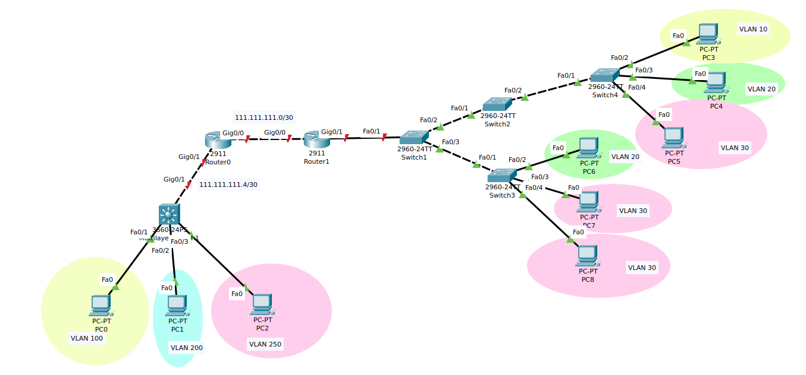

# Lab 03 - Laborator VLANs

## Topolgoie




## Cerinte

### Cerinta 1

Configurați IP-uri conform topologiei. 50p

- VLAN 10 -> 10.10.10.0/24
- VLAN 20 -> 20.20.20.0/24
- VLAN 30 -> 30.30.30.0/24
<br>
- VLAN 100 -> 100.100.100.0/24
- VLAN 200 -> 100.100.200.0/24
- VLAN 250 -> 100.100.250.0/24


Prima adresa asignabila se va asigna Default Gateway-ului.

End device-urile vor primii urmatoarele adrese ip in ordinea index-urilor, iar in retelele dintre routere se va asigna prima adresa routerului din stanga.


### Cerinta 2

Configurați porturile switch-urilor în modurile adecvate pentru a crea VLAN-urile necesare fara a le redenumi. 20p


### Cerinta 3

Configurați RoaS pe router-ele necesare. 15p


### Cerinta 4

Configurați rute statice pentru conectivitate end-to-end. 15p


## Tasks 1, 3: asignare adrese IP + RoaS config

- PC3 (Desktop -> IP Configuration):
  - IPv4 Address: 10.10.10.2
  - Subnet Mask: 255.255.255.0
  - Default Gateway: 10.10.10.1

- PC4:
  - IPv4 Address: 20.20.20.2
  - Subnet Mask: 255.255.255.0
  - Default Gateway: 20.20.20.1 

- PC5:
  - IPv4 Address: 30.30.30.2
  - Subnet Mask: 255.255.255.0
  - Default Gateway: 30.30.30.1

- PC6:
  - IPv4 Address: 20.20.20.3
  - Subnet Mask: 255.255.255.0
  - Default Gateway: 20.20.20.1


- PC7:
  - IPv4 Address: 30.30.30.3
  - Subnet Mask: 255.255.255.0
  - Default Gateway: 30.30.30.1


- PC8:
  - IPv4 Address: 30.30.30.4
  - Subnet Mask: 255.255.255.0
  - Default Gateway: 30.30.30.1


- PC0:
  - IPv4 Address: 100.100.100.2
  - Subnet Mask: 255.255.255.0
  - Default Gateway: 100.100.100.1


- PC1:
  - IPv4 Address: 100.100.200.2
  - Subnet Mask: 255.255.255.0
  - Default Gateway: 100.100.200.1

- PC2:
  - IPv4 Address: 100.100.250.2
  - Subnet Mask: 255.255.255.0
  - Default Gateway: 100.100.250.1


- Multilayer Switch1:
```sh
Switch(config)# vlan 100
Switch(config-vlan)# exit
Switch(config)# int vlan 100
Switch(config-if)# ip address 100.100.100.1 255.255.255.0
Switch(config-if)# exit
Switch(config)# vlan 200
Switch(config-vlan)# exit
Switch(config)# int vlan 200
Switch(config-if)# ip address 100.100.200.1 255.255.255.0
Switch(config-if)# exit
Switch(config)# vlan 250
Switch(config-vlan)# exit
Switch(config)# int vlan 250
Switch(config-if)# ip address 100.100.250.1 255.255.255.0
Switch(config-if)# exit

! Enable IP routing
Switch(config)# ip routing

Switch(config)# int gig0/1
Switch(config-if)# no switchport 
Switch(config-if)# ip address 111.111.111.5 255.255.255.252
Switch(config-if)# no shut
```


- Roas (Router-on-a-Stick) pentru Router1:
```sh
Router(config)# int gig0/1.10
Router(config-subif)# encapsulation dot1Q 10
Router(config-subif)# ip address 10.10.10.1 255.255.255.0
Router(config-subif)# exit
Router(config)# int gig0/1.20
Router(config-subif)# encapsulation dot1Q 20
Router(config-subif)# ip address 20.20.20.1 255.255.255.0
Router(config-subif)# exit
Router(config)# int gig0/1.30
Router(config-subif)# encapsulation dot1Q 30
Router(config-subif)# ip address 30.30.30.1 255.255.255.0
Router(config-subif)# exit
Router(config)# int gig0/1
Router(config-if)# no shut
```


- Router0:
```sh
Router(config)# int gig0/1
Router(config-if)# ip address 111.111.111.6 255.255.255.252
Router(config-if)# no shut
Router(config-if)# exit
Router(config)# int gig0/0
Router(config-if)# ip address 111.111.111.1 255.255.255.252
Router(config-if)# no shut
```


- Router1:
```sh
Router(config)# int gig0/0
Router(config-if)# ip address 111.111.111.2 255.255.255.252
Router(config-if)# no shut
```


## Task 2: configurare porturi trunk/access pe switch-uri

- Multilayer Switch1:
```sh
Switch(config)# int fa0/1
Switch(config-if)# switchport mode access
Switch(config-if)# switchport access vlan 100
Switch(config-if)# exit
Switch(config)# int fa0/2
Switch(config-if)# switchport mode access
Switch(config-if)# switchport access vlan 200
Switch(config-if)# exit
Switch(config)# int fa0/3
Switch(config-if)# switchport mode access
Switch(config-if)# switchport access vlan 250
```


- Switch1:
```sh
! Creare VLAN-uri:
Switch(config)# vlan 10
Switch(config-vlan)# exit
Switch(config)# vlan 20
Switch(config-vlan)# exit
Switch(config)# vlan 30
Switch(config-vlan)# exit

! Cealalt capat al legaturii fizice (Router1-gig0/1) este configurat RoaS
Switch(config)# int fa0/1
Switch(config-if)# switchport mode trunk
Switch(config-if)# switchport trunk allowed vlan 10,20,30
Switch(config-if)# exit

Switch(config)# int fa0/2
Switch(config-if)# switchport mode trunk
Switch(config-if)# switchport trunk allowed vlan 10,20,30
Switch(config-if)# exit

Switch(config)# int fa0/3
Switch(config-if)# switchport mode trunk
Switch(config-if)# switchport trunk allowed vlan 10,20,30
Switch(config-if)# exit
```


- Switch2:
```sh
! Creare VLAN-uri:
Switch(config)# vlan 10
Switch(config-vlan)# exit
Switch(config)# vlan 20
Switch(config-vlan)# exit
Switch(config)# vlan 30
Switch(config-vlan)# exit

Switch(config)# int fa0/1
Switch(config-if)# switchport mode trunk
Switch(config-if)# switchport trunk allowed vlan 10,20,30
Switch(config-if)# exit

Switch(config)# int fa0/2
Switch(config-if)# switchport mode trunk
Switch(config-if)# switchport trunk allowed vlan 10,20,30
Switch(config-if)# exit
```


- Switch3:
```sh
! Creare VLAN-uri:
Switch(config)# vlan 10
Switch(config-vlan)# exit
Switch(config)# vlan 20
Switch(config-vlan)# exit
Switch(config)# vlan 30
Switch(config-vlan)# exit

Switch(config)# int fa0/1
Switch(config-if)# switchport mode trunk
Switch(config-if)# switchport trunk allowed vlan 10,20,30
Switch(config-if)# exit

Switch(config)# int fa0/2
Switch(config-if)# switchport mode access
Switch(config-if)# switchport access vlan 20
Switch(config-if)# exit

Switch(config)# int fa0/3
Switch(config-if)# switchport mode access
Switch(config-if)# switchport access vlan 30
Switch(config-if)# exit

Switch(config)# int fa0/4
Switch(config-if)# switchport mode access
Switch(config-if)# switchport access vlan 30
Switch(config-if)# exit
```


- Switch4:
```sh
! Creare VLAN-uri:
Switch(config)# vlan 10
Switch(config-vlan)# exit
Switch(config)# vlan 20
Switch(config-vlan)# exit
Switch(config)# vlan 30
Switch(config-vlan)# exit

Switch(config)# int fa0/1
Switch(config-if)# switchport mode trunk
Switch(config-if)# switchport trunk allowed vlan 10,20,30
Switch(config-if)# exit

Switch(config)# int fa0/2
Switch(config-if)# switchport mode access
Switch(config-if)# switchport access vlan 10
Switch(config-if)# exit

Switch(config)# int fa0/3
Switch(config-if)# switchport mode access
Switch(config-if)# switchport access vlan 20
Switch(config-if)# exit

Switch(config)# int fa0/4
Switch(config-if)# switchport mode access
Switch(config-if)# switchport access vlan 30
Switch(config-if)# exit
```


## Task 4: rute statice


- Multilayer Switch1:
```sh
Switch(config)# ip route 10.10.10.0 255.255.255.0 111.111.111.6
Switch(config)# ip route 20.20.30.0 255.255.255.0 111.111.111.6
Switch(config)# ip route 30.30.30.0 255.255.255.0 111.111.111.6
```


- Router0:
```sh
Router(config)# ip route 100.100.100.0 255.255.255.0 111.111.111.5
Router(config)# ip route 100.100.200.0 255.255.255.0 111.111.111.5
Router(config)# ip route 100.100.250.0 255.255.255.0 111.111.111.5

Router(config)# ip route 10.10.10.0 255.255.255.0 111.111.111.2
Router(config)# ip route 20.20.20.0 255.255.255.0 111.111.111.2
Router(config)# ip route 30.30.30.0 255.255.255.0 111.111.111.2
```

- Router1:
```sh
Router(config)# ip route 100.100.100.0 255.255.255.0 111.111.111.1
Router(config)# ip route 100.100.200.0 255.255.255.0 111.111.111.1
Router(config)# ip route 100.100.250.0 255.255.255.0 111.111.111.1
```
