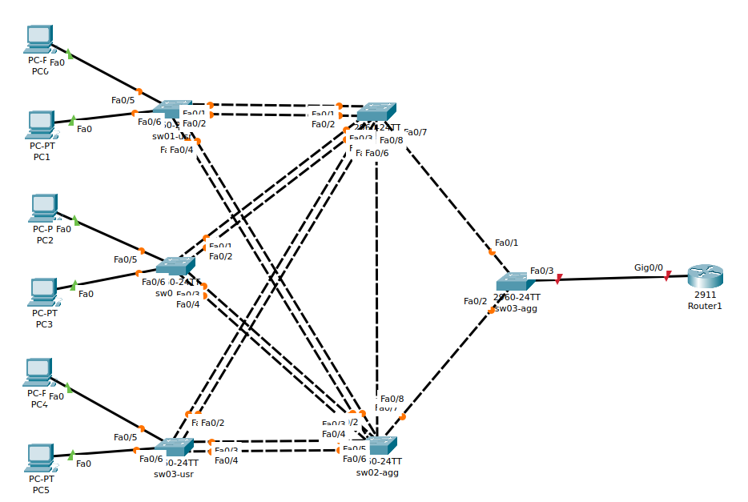

# Lab 04 - Laborator STP & Etherchannel


## Topologie



## Cerinta

### Cerinta 1

Asignați adrese din pool-ul 10.10.10.0/24 pe Router și PC-uri în felul următor: 
primul IP pe Router1, următoarele IP-uri pe PC-uri în ordine crescătoare. 20p

### Cerinta 2

Configurați hostname-uri pe echipamente conform denumirii din topologie. 10p


### Cerinta 3

Între switch-urile de utilizatori (sw0x-usr) si switch-urile de agregare (sw0x-agg) se vor crea legaturi layer 2, de tip etherchannel.

- Între switch-ul sw01-agg si cele 3 switch-uri de utilizatori se va folosi un protocol de agregare non-proprietar;
  ambele capete ale etherchannel-ului vor fi configurate astfel incat sa initieze negocierea formarii link-ului.
  Channel group number va fi X pentru legătura cu sw0X-usr 30p
- Între switch-ul sw02-agg si cele 3 switch-uri de utilizatori se va folosi un protocol de agregare proprietar Cisco;
  ambele capete ale etherchannel-ului vor fi configurate astfel incat sa initieze negocierea formarii link-ului.
  Channel group number va fi X+3 pentru legătura cu sw0X-usr 30p

### Cerinta 4

Configurați STP a.î. sw01-agg să fie întotdeauna Root Bridge cu urmatoare prioritate dupa cea default. (10p)


## Task 1: asignare adrese IP


- Router1:
```sh
Router> en
Router# conf t
Router(config)# int gig0/0
Router(config-if)# ip addr 10.10.10.1 255.255.255.0
Router(config-if)# no shut
```

- PC0 (Desktop -> IP Configuration):
  - IPv4 Address: 10.10.10.2
  - Subnet Mask: 255.255.255.0
  - Default Gateway: 10.10.10.1

- PC1:
  - IPv4 Address: 10.10.10.3
  - Subnet Mask: 255.255.255.0
  - Default Gateway: 10.10.10.1

- PC2:
  - IPv4 Address: 10.10.10.4
  - Subnet Mask: 255.255.255.0
  - Default Gateway: 10.10.10.1

- PC3:
  - IPv4 Address: 10.10.10.5
  - Subnet Mask: 255.255.255.0
  - Default Gateway: 10.10.10.1


- PC4:
  - IPv4 Address: 10.10.10.6
  - Subnet Mask: 255.255.255.0
  - Default Gateway: 10.10.10.1


- PC5:
  - IPv4 Address: 10.10.10.7
  - Subnet Mask: 255.255.255.0
  - Default Gateway: 10.10.10.1


## Task 2: hostnames

- sw01-usr:
```sh
Switch(config)# hostname sw01-usr
sw01-usr(config)#
```

- sw02-usr:
```sh
Switch(config)# hostname sw02-usr
sw02-usr(config)#
```

- sw03-usr:
```sh
Switch(config)# hostname sw03-usr
sw03-usr(config)#
```


- sw01-agr:
```sh
Switch(config)# hostname sw01-agg
sw01-agg(config)#
```

- sw02-agr:
```sh
Switch(config)# hostname sw02-agg
sw02-agg(config)#
```

- Router1:
```sh
Router(config)# hostname Router1
Router1(config)#
```


## Task 3: Etherchannel-uri


> - **LACP**: protocol de agegare non-prioprietar Cisco
> - **PAgp**: protocol de agregare proprietar Cisco

> - Moduri de negociere specifice **LACP**: on/active/passive
> - Moduri de negociere specifice **PAgP**: on/desirable/auto

> - **active**: modul **LACP** care initiaza negocierea
> - **desirable**: modul **PAgp** care initiaza negocierea


- sw01-usr:
```sh
! Etherchannel-uri non-proprietare (LACP):
sw01-usr(config)# int fa0/1
sw01-usr(config-if)# switchport mode trunk
sw01-usr(config-if)# channel-group 1 mode active
sw01-usr(config-if)# exit
sw01-usr(config)# int fa0/2
sw01-usr(config-if)# switchport mode trunk
sw01-usr(config-if)# channel-group 1 mode active
sw01-usr(config-if)# exit

! Etherchannel-uri proprietare (PAgP):
sw01-usr(config)# int fa0/3
sw01-usr(config-if)# switchport mode trunk
sw01-usr(config-if)# channel-group 4 mode desirable
sw01-usr(config-if)# exit
sw01-usr(config)# int fa0/4
sw01-usr(config-if)# switchport mode trunk
sw01-usr(config-if)# channel-group 4 mode desirable
sw01-usr(config-if)# exit

! Verificare:
sw01-usr(config-if)# exit
sw01-usr(config)# exit
sw01-usr# do show etherchannel summary
```


- sw02-usr:
```sh
! Etherchannel-uri non-proprietare (LACP):
sw02-usr(config)# int fa0/1
sw02-usr(config-if)# switchport mode trunk
sw02-usr(config-if)# channel-group 2 mode active
sw02-usr(config-if)# exit
sw02-usr(config)# int fa0/2
sw02-usr(config-if)# switchport mode trunk
sw02-usr(config-if)# channel-group 2 mode active
sw02-usr(config-if)# exit

! Etherchannel-uri proprietare (PAgP):
sw02-usr(config)# int fa0/3
sw02-usr(config-if)# switchport mode trunk
sw02-usr(config-if)# channel-group 5 mode desirable
sw02-usr(config-if)# exit
sw02-usr(config)# int fa0/4
sw02-usr(config-if)# switchport mode trunk
sw02-usr(config-if)# channel-group 5 mode desirable
sw02-usr(config-if)# exit

! Verificare:
sw02-usr(config-if)# exit
sw02-usr(config)# exit
sw02-usr# do show etherchannel summary
```


- sw03-usr:
```sh
! Etherchannel-uri non-proprietare (LACP):
sw03-usr(config)# int fa0/1
sw03-usr(config-if)# switchport mode trunk
sw03-usr(config-if)# channel-group 3 mode active
sw03-usr(config-if)# exit
sw03-usr(config)# int fa0/2
sw03-usr(config-if)# switchport mode trunk
sw03-usr(config-if)# channel-group 3 mode active
sw03-usr(config-if)# exit

! Etherchannel-uri proprietare (PAgP):
sw03-usr(config)# int fa0/3
sw03-usr(config-if)# switchport mode trunk
sw03-usr(config-if)# channel-group 6 mode desirable
sw03-usr(config-if)# exit
sw03-usr(config)# int fa0/4
sw03-usr(config-if)# switchport mode trunk
sw03-usr(config-if)# channel-group 6 mode desirable
sw03-usr(config-if)# exit

! Verificare:
sw03-usr(config-if)# exit
sw03-usr(config)# exit
sw03-usr# do show etherchannel summary
```


- sw01-agg:
```sh
! Etherchannel-uri non-proprietare (LACP):
sw01-agg(config)# int fa0/1
sw01-agg(config-if)# switchport mode trunk
sw01-agg(config-if)# channel-group 1 mode active
sw01-agg(config-if)# exit
sw01-agg(config)# int fa0/2
sw01-agg(config-if)# switchport mode trunk
sw01-agg(config-if)# channel-group 1 mode active
sw01-agg(config-if)# exit
sw01-agg(config)# int fa0/3
sw01-agg(config-if)# switchport mode trunk
sw01-agg(config-if)# channel-group 2 mode active
sw01-agg(config-if)# exit
sw01-agg(config)# int fa0/4
sw01-agg(config-if)# switchport mode trunk
sw01-agg(config-if)# channel-group 2 mode active
sw01-agg(config-if)# exit
sw01-agg(config)# int fa0/5
sw01-agg(config-if)# switchport mode trunk
sw01-agg(config-if)# channel-group 3 mode active
sw01-agg(config-if)# exit
sw01-agg(config)# int fa0/6
sw01-agg(config-if)# switchport mode trunk
sw01-agg(config-if)# channel-group 3 mode active
sw01-agg(config-if)# exit

! Verificare:
sw01-agg(config)# do sh etherchannel summary
```


- sw02-agg:
```sh
! Etherchannel-uri proprietare (PAgP):
sw02-agg(config)# int fa0/1
sw02-agg(config-if)# switchport mode trunk
sw02-agg(config-if)# channel-group 4 mode desirable
sw02-agg(config-if)# exit
sw02-agg(config)# int fa0/2
sw02-agg(config-if)# switchport mode trunk
sw02-agg(config-if)# channel-group 4 mode desirable
sw02-agg(config-if)# exit
sw02-agg(config)# int fa0/3
sw02-agg(config-if)# switchport mode trunk
sw02-agg(config-if)# channel-group 5 mode desirable
sw02-agg(config-if)# exit
sw02-agg(config)# int fa0/4
sw02-agg(config-if)# switchport mode trunk
sw02-agg(config-if)# channel-group 5 mode desirable
sw02-agg(config-if)# exit
sw02-agg(config)# int fa0/5
sw02-agg(config-if)# switchport mode trunk
sw02-agg(config-if)# channel-group 6 mode desirable
sw02-agg(config-if)# exit
sw02-agg(config)# int fa0/6
sw02-agg(config-if)# switchport mode trunk
sw02-agg(config-if)# channel-group 6 mode desirable
sw02-agg(config-if)# exit

! Verificare:
sw02-agg(config)# do sh etherchannel summary
```


## Task 4: setare prioritate Root Bridge


```sh
sw01-agg(config)# spanning-tree vlan 1 root primary
```
