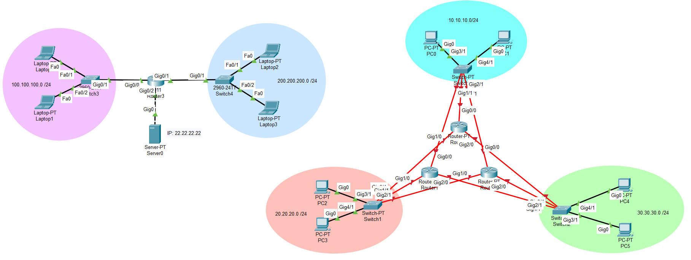

# Lab 5 - DHCP si HSRP

## Topologie



## Cerinta

1. Configurati Router3 ca server DHCP pentru reteaua 100.100.100.0 /24 respectand urmatorele conditii: 15p
  - Pool-ul se va numi LAN-1-POOL
  - Se vor exclude adresele 100.100.100.1 - 100.100.100.9
  - Prima adresa IP asignabila din pool va fi 100.100.100.10
  - Se va asigna serverul dns 1.1.1.1
  - Se va configura domeniul learndhcp.com

2. Configurati Router3 ca relay DHCP pentru reteaua 200.200.200.0 /24 folosind Server0 ca server DHCP. 5p

3. Configurati IP-urile pe routere tinand ca: 30p
  - Router0 va primii prima adresa asignabila a fiecarei retele
  - Router1 va primii a doua adresa asignabila
  - Router2 va primii a treia adresa asignabila

4. Configurati HSRP pe fiecare router conform cerintelor: 50p
  - Interfata corespunzatoare retelei Y.Y.Y.0 /24 va apartine gruparii Y
  - Adresa gruparii va fi ultima adresa asignabila din reteaua corespunzatoare
  - Router0 va avea prioritatea 120 pentru toate cele 3 grupari
  - Router1 va avea prioritatea 110 pentru toate gruparile
  - Router2 va pastra prioritatea default de 100
  - Asigurati-va ca Router0 si Router1 pot redeveni active dupa o scurta deconectare


## Task 1: Configurare Server DHCPv4

- Router3:
```sh
Router(config)# ip dhcp excluded-address 100.100.100.1 100.100.100.9
Router(config)# ip dhcp pool LAN-1-POOL
Router(dhcp-config)# network 100.100.100.0 255.255.255.0
Router(dhcp-config)# default-router 100.100.100.1
Router(dhcp-config)# dns-server 1.1.1.1
Router(dhcp-config)# domain-name learndhcp.com
Router(dhcp-config)# exit
```


## Task 2: Configurare DHCPv4 Relay

- Router3:
```sh
! Adresa IP Server0: 22.22.22

! Interface gig1/0 este in reteaua 200.200.200.0 /24
Router(config)# do sh ip int br

Router(config)# int gig0/1
Router(config-if)# ip helper-address 22.22.22.22
Router(config-if)# exit
```

## Task 3: asignare adrese IP pe routere

Pentru fiecare dintre ruterele **Router0**, **Router1**, **Router2**:
- Interfata **gig0/0** se afla in reteaua **10.10.10.0/24**
- Interfata **gig1/0** se afla in reteaua **20.20.20.0/24**
- Interfata **gig2/0** se afla in reteaua **30.30.30.0/24**


Configurari:

- Router0:
```sh
Router(config)# int gig0/0
Router(config-if)# ip address 10.10.10.1 255.255.255.0
Router(config-if)# no shut
Router(config-if)# exit

Router(config)# int gig1/0
Router(config-if)# ip address 20.20.20.1 255.255.255.0
Router(config-if)# no shut
Router(config-if)# exit

Router(config)# int gig2/0
Router(config-if)# ip address 30.30.30.1 255.255.255.0
Router(config-if)# no shut
Router(config-if)# exit
```


- Router1:
```sh
Router(config)# int gig0/0
Router(config-if)# ip address 10.10.10.2 255.255.255.0
Router(config-if)# no shut
Router(config-if)# exit

Router(config)# int gig1/0
Router(config-if)# ip address 20.20.20.2 255.255.255.0
Router(config-if)# no shut
Router(config-if)# exit

Router(config)# int gig2/0
Router(config-if)# ip address 30.30.30.2 255.255.255.0
Router(config-if)# no shut
Router(config-if)# exit
```

- Router2:
```sh
Router(config)# int gig0/0
Router(config-if)# ip address 10.10.10.3 255.255.255.0
Router(config-if)# no shut
Router(config-if)# exit

Router(config)# int gig1/0
Router(config-if)# ip address 20.20.20.3 255.255.255.0
Router(config-if)# no shut
Router(config-if)# exit

Router(config)# int gig2/0
Router(config-if)# ip address 30.30.30.3 255.255.255.0
Router(config-if)# no shut
Router(config-if)# exit
```


## Task 4: Configurare HSRP

- Router0:
```sh
Router(config)# int gig0/0
Router(config-if)# standby 10 ip 10.10.10.254
Router(config-if)# standby 10 priority 120
Router(config-if)# standby 10 preempt 
Router(config-if)# exit

Router(config)# int gig1/0
Router(config-if)# standby 20 ip 20.20.20.254
Router(config-if)# standby 20 priority 120
Router(config-if)# standby 20 preempt 
Router(config-if)# exit

Router(config)# int gig2/0
Router(config-if)# standby 30 ip 30.30.30.254
Router(config-if)# standby 30 priority 120
Router(config-if)# standby 30 preempt 
Router(config-if)# exit
```

- Router1:
```sh
Router(config)# int gig0/0
Router(config-if)# standby 10 ip 10.10.10.254
Router(config-if)# standby 10 priority 110
Router(config-if)# standby 10 preempt 
Router(config-if)# exit

Router(config)# int gig1/0
Router(config-if)# standby 20 ip 20.20.20.254
Router(config-if)# standby 20 priority 110
Router(config-if)# standby 20 preempt 
Router(config-if)# exit

Router(config)# int gig2/0
Router(config-if)# standby 30 ip 30.30.30.254
Router(config-if)# standby 30 priority 110
Router(config-if)# standby 30 preempt 
Router(config-if)# exit
```

- Router2:
> Pe **Router2** nu se ruleaza comanda `standby <ID_grupare> preempt`
```sh
Router(config)# int gig0/0
Router(config-if)# standby 10 ip 10.10.10.254
Router(config-if)# exit

Router(config)# int gig1/0
Router(config-if)# standby 20 ip 20.20.20.254
Router(config-if)# exit

Router(config)# int gig2/0
Router(config-if)# standby 30 ip 30.30.30.254
Router(config-if)# exit
```


## Explicatii suplimentare

### Prioritatile HSRP

Într-o grupare HSRP:
- Routerul cu prioritatea cea mai mare devine Active.
- Routerul cu prioritate mai mică devine Standby.
- Restul devin Listening (Backup).

Dacă folosești comanda:
```sh
standby <ID> preempt
```
înseamnă:

> „Dacă eu am prioritate mai mare decât Active-ul actual,
> îl dau jos și iau eu rolul de Active imediat ce devin disponibil.”


### De ce sa NU pui `preempt` pe routerul cu prioritate default (100)?

Pentru că acel router **nu ar trebui niciodată să preia rolul de Active**,
fiind intenționat configurat cu prioritate cea mai mică.


Dacă îi pui `preempt`, atunci:
- Dacă routerele cu prioritate 120 și 110 cad temporar (ex. **reboot**),
  routerul cu prioritate 100 va deveni Active.
- Când celelalte două revin,
  routerul cu prioritate 100 **nu va renunța automat la rolul Active**,
  deoarece ele trebuie să aibă și ele preempt pentru a-l înlocui

Cu alte cuvinte:
Routerul cel mai slab (cu prioritate mică) nu ar trebui să forțeze preluarea rolului Active,
nici temporar.

> În **HSRP** doar routerele care **au prioritate ridicată**
> și sunt candidate serioase pentru trafic
> ar trebui să aibă `preempt`.

