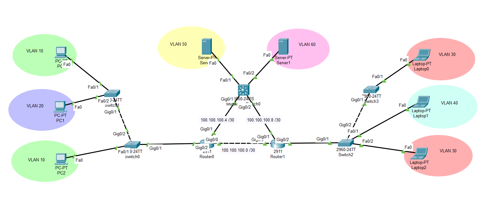

# Examen Partial Practic CCNA2

## Topologie




## Cerinte

Timpul total de rezolvare este de 45 de minute.
Punctajul total este de 200 de punce.
Pentru promovare sunt necesare 140/200p.


Pentru rezolvare subiectului se va tine cont de urmatorele conventii:
- Reteua pentru VLAN "A" va fi A.A.A.0 /24
- Prima adresa IP asignabila va fi rezervata pentru Def Gateway
- End device-urile vor primii urmatoarele adrese IP in ordinea indexurilor
- In reteaua R0 - R1, R0 va primii prima adresa; In reteua R0 - SwL3 -> R0; In reteaua R1 - SwL3 -> R1

Cerinte:
1. Asignati IP-uri, mastile de retea si Default Gateway-urile corespunzatoare pentru fiecare end device. **30p**

2. Realizati configurarile necesare pe Switch-uri pentru VLAN-urile date (Se include si MS0). **40p**

3. Configurati Roas pe routere pentru a permite rutarea inter-VLAN. **40p**

4. Realizati configurarile necesare pe Switch-ul de nivel 3 pentru a permite rutarea inter-VLAN. **20p**

5. Realizati configurarile necesare pentru retelele dintre routere,
   tinand cont ca prima adresa ip va fi asignata device-ului cu denumirea albastra:
   **R0**-R1, **R0**-MS0, **R1**-MS0. **30p**

6. Configurati rute statice pentru a asigura conectivitate end-to-end. **30p**

7. Configurati ruta flotanta pe R0 catre VLAN 50 si VLAN 60 cu Distanta Administrativa 5 **10p**


## Task 1: asignare adrese IP pe end-devices


- PC0 din VLAN 10 (Desktop -> IP Configuration):
  - IPv4 Address: 10.10.10.2
  - Subnet Mask: 255.255.255.0
  - Default Gateway: 10.10.10.1

- PC1 din VLAN 20:
  - IPv4 Address: 20.20.20.2
  - Subnet Mask: 255.255.255.0
  - Default Gateway: 20.20.20.1

- PC2 din VLAN 10:
  - IPv4 Address: 10.10.10.3
  - Subnet Mask: 255.255.255.0
  - Default Gateway: 10.10.10.1

- Server0 din VLAN 50:
  - IPv4 Address: 50.50.50.2
  - Subnet Mask: 255.255.255.0
  - Default Gateway: 50.50.50.1

- Server1 din VLAN 60:
  - IPv4 Address: 60.60.60.2
  - Subnet Mask: 255.255.255.0
  - Default Gateway: 60.60.60.1

- Laptop0 din VLAN 30:
  - IPv4 Address: 30.30.30.2
  - Subnet Mask: 255.255.255.0
  - Default Gateway: 30.30.30.1

- Laptop1 din VLAN 40:
  - IPv4 Address: 40.40.40.2
  - Subnet Mask: 255.255.255.0
  - Default Gateway: 40.40.40.1

- Laptop2 din VLAN 30:
  - IPv4 Address: 30.30.30.3
  - Subnet Mask: 255.255.255.0
  - Default Gateway: 30.30.30.1


## Task 2: configurare switch-uri


- Switch1:
```sh
Switch> en
Switch# conf t

Switch(config)# int fa0/1
Switch(config-if)# switchport mode access
Switch(config-if)# switchport access vlan 10
% Access VLAN does not exist. Creating vlan 10
Switch(config-if)# exit

Switch(config)# int fa0/2
Switch(config-if)# switchport mode access
Switch(config-if)# switchport access vlan 20
% Access VLAN does not exist. Creating vlan 20
Switch(config-if)# exit

Switch(config)# int gig0/1
Switch(config-if)# switchport mode trunk
Switch(config-if)# switchport trunk allowed vlan 10,20
```

- Switch0:
```sh
Switch> en
Switch# conf t

Switch(config)# int fa0/1
Switch(config-if)# switchport mode access
Switch(config-if)# switchport access vlan 10
% Access VLAN does not exist. Creating vlan 10
Switch(config-if)# exit

Switch(config-if)# vlan 20
Switch(config-vlan)# exit

Switch(config)# int gig0/1
Switch(config-if)# switchport mode trunk
Switch(config-if)# switchport trunk allowed vlan 10,20
Switch(config-if)# exit

Switch(config)# int gig0/2
Switch(config-if)# switchport mode trunk
Switch(config-if)# switchport trunk allowed vlan 10,20
```


- Switch2:
```sh
Switch> en
Switch# conf t

Switch(config)# int fa0/1
Switch(config-if)# switchport mode access
Switch(config-if)# switchport access vlan 40
% Access VLAN does not exist. Creating vlan 40
Switch(config-if)# exit

Switch(config)# int fa0/2
Switch(config-if)# switchport mode access
Switch(config-if)# switchport access vlan 30
% Access VLAN does not exist. Creating vlan 30
Switch(config-if)# exit

Switch(config)# int gig0/1
Switch(config-if)# switchport mode trunk
Switch(config-if)# switchport trunk allowed vlan 30,40
Switch(config-if)# exit

Switch(config)# int gig0/2
Switch(config-if)# switchport mode trunk
Switch(config-if)# switchport trunk allowed vlan 30,40
```

- Switch3:
```sh
Switch> en
Switch# conf t

Switch(config)# int fa0/1
Switch(config-if)# switchport mode access
Switch(config-if)# switchport access vlan 30
% Access VLAN does not exist. Creating vlan 30
Switch(config-if)# exit
Switch(config)# int gig0/1
Switch(config-if)# switchport mode trunk
Switch(config-if)# switchport trunk allowed vlan 30
```

## Task 3: configurare **RoaS** (Router-on-a-Stick)

- Router0:
```sh
Router> en
Router# conf t

! Pentru VLAN 10:
Router(config)# int gig0/2.10
Router(config-subif)# encapsulation dot1Q 10
Router(config-subif)# ip address 10.10.10.1 255.255.255.0
Router(config-subif)# exit

! Pentru VLAN 20:
Router(config)# int gig0/2.20
Router(config-subif)# enc dot1q 20
Router(config-subif)# ip address 20.20.20.1 255.255.255.0
Router(config-subif)# exit


! Pornesc interfata fizica:
Router(config)# int gig0/2
Router(config-if)# no shutdown
```

- Router1:
```sh
Router> en
Router# conf t

! Pentru VLAN 30:
Router(config)# int gig0/2.30
Router(config-subif)# encapsulation dot1Q 30
Router(config-subif)# ip address 30.30.30.1 255.255.255.0
Router(config-subif)# exit

! Pentru VLAN 40:
Router(config)# int gig0/2.40
Router(config-subif)# enc dot1q 40
Router(config-subif)# ip address 40.40.40.1 255.255.255.0
Router(config-subif)# exit

! Pornesc interfata fizica:
Router(config)# int gig0/2
Router(config-if)# no shut
```


## Task 4: configurare switch de nivel 3


- Multilayer Switch0:
```sh
Switch> en
Switch# conf t

! Enable IP routing:
Switch(config)# ip routing

! Interfata din VLAN 50:
Switch(config)# vlan 50
Switch(config-vlan)# exit
Switch(config)# interface vlan 50
Switch(config-if)# ip address 50.50.50.1 255.255.255.0
Switch(config-if)# no shut
Switch(config-if)# exit

! Interfata din VLAN 60:
Switch(config)# vlan 60
Switch(config-vlan)# interface vlan 60
Switch(config-if)# ip address 60.60.60.1 255.255.255.0
Switch(config-if)# no shut
Switch(config-if)# exit

! Interfata conectata la Router0:
Switch(config)# int gig0/1
Switch(config-if)# no switchport
Switch(config-if)# ip address 100.100.100.6 255.255.255.252
Switch(config-if)# exit

! Interfata conectata la Router1:
Switch(config)# int gig0/2
Switch(config-if)# no switchport
Switch(config-if)# ip address 100.100.100.10 255.255.255.252
Switch(config-if)# exit
```


## Task 5: asignare adrese IP pe rutere

- Router0:
```sh
Router(config)# int gig0/0
Router(config-if)# ip address 100.100.100.1 255.255.255.252
Router(config-if)# no shut
Router(config-if)# exit

Router(config)# int gig0/1
Router(config-if)# ip address 100.100.100.5 255.255.255.252
Router(config-if)# no shut
Router(config-if)# exit
```


- Router1:
```sh
Router(config)# int gig0/0
Router(config-if)# ip address 100.100.100.2 255.255.255.252
Router(config-if)# no shut
Router(config-if)# exit

Router(config)# int gig0/1
Router(config-if)# ip address 100.100.100.9 255.255.255.252
Router(config-if)# no shut
Router(config-if)# exit
```


## Task 6: rute statice

- Router0:
```sh
Router(config)# ip route 30.30.30.0 255.255.255.0 100.100.100.2
Router(config)# ip route 40.40.40.0 255.255.255.0 100.100.100.2

Router(config)# ip route 50.50.50.0 255.255.255.0 100.100.100.6
Router(config)# ip route 60.60.60.0 255.255.255.0 100.100.100.6
```

- Router1:
```sh
Router(config)# ip route 10.10.10.0 255.255.255.0 100.100.100.1
Router(config)# ip route 20.20.20.0 255.255.255.0 100.100.100.1

Router(config)# ip route 50.50.50.0 255.255.255.0 100.100.100.10
Router(config)# ip route 60.60.60.0 255.255.255.0 100.100.100.10
```

- Multilayer Switch0:
```sh
Switch(config)# ip route 10.10.10.0 255.255.255.0 100.100.100.5
Switch(config)# ip route 20.20.20.0 255.255.255.0 100.100.100.5

Switch(config)# ip route 30.30.30.0 255.255.255.0 100.100.100.9
Switch(config)# ip route 40.40.40.0 255.255.255.0 100.100.100.9
```

## Task 7: ruta flotanta

- Router0:
```sh
! Folosesc Router1 ca next hop in ruta flotanta
Router(config)# ip route 50.50.50.0 255.255.255.0 100.100.100.2 5
Router(config)# ip route 60.60.60.0 255.255.255.0 100.100.100.2 5
```

